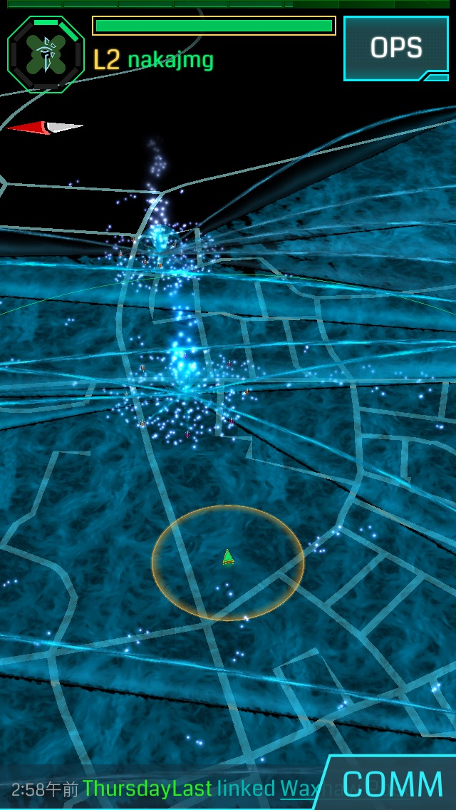

title: Dive into Ingress!!
output: ingress.html
style: ingress.css

-- 

# How to Ingress!!

--

### Ingressの目的

# 青 vs 緑
## 陣取り合戦

--

### 陣取り？
# ポータルを取りあう

--

### Ingress用語

* XM
* AP
* ITEM
  * MOD
* Portal
* Hack
* Resonator
* Link
  * Control field

--

### XM(エキゾチックマター)
#### スタミナみたいなの (色々な行動に使う

* Hack
* ResonatorのDeploy
  * Recharge
  * Fire XMP(攻撃)
* Link

-- 

### XMの取得方法
#### マップ上の青白いちっちゃい物体があるとこに移動すると増える

※ 画面上部のバーをタップすると量が見れる

--

### AP(アクセスポイント)
#### 経験値
レベルアップに必要。まずはとにかくレベル上げ(後述)

--

### Item
* Resonator
* XMPバースター
* Ultra Strike
* Virus & Refactor
* Power Cube
* Portal Key

[※ ITEM一覧](https://support.google.com/ingress/answer/4624165?hl=ja&ref_topic=4624340)

--

### MOD
#### Portalに設置するアイテム

* Sheild
* Heat sink
* Multi-hack
* Link Amp
* Force Amp
* Turret

[※ MOD一覧](http://ingresswiki.wiki.fc2.com/wiki/%E3%82%A2%E3%82%A4%E3%83%86%E3%83%A0%EF%BC%88items%EF%BC%89)

-- showcase

### Portal
#### 拠点

* MAP上にある光の柱みたいなやつ
* IngressはこのPortalの取り合いをする

--

### Portalの状態

* 白 = 中立
* 青 = 青陣営
* 緑 = 緑陣営

中立はResonatorを指すことで自陣営のものにできる

※ ただしResonatorは何もしないと3日程度で壊れる。敵の攻撃を受けたらもっと早く

--

### Portalの役目

* Hackして
  * AP取得
  * MOD取得
* Linkして
  * AP取得
  * CF形成 (陣地を作る)

--

### Hack
#### アイテムとAPの入手

* 自色だとResonator(確定) + α
* 敵色だと100AP
  * XMが減る (反撃してくる)
  
とにかくPortalをHackする

--

### Hack回数の制限
#### 同一Portalに対して5分ごとに4回まで
その後4時間はHackできない

※ MODを使うと連続Hack可能

--

### Portalのレベル
#### 全Resonatorのレベルを足して8で割った値

* レベルによって変わるもの
  * 耐久度
  * 反撃力
  * Hackする際のXMコスト
    * Portalレベル * 50XM
    * 敵Portalは * 100XM + 反撃 ?
  * Link可能距離

レベルが高いほど壊れにくい(壊しにくい)

--

### Resonator
#### PortalをCapture(制圧)するためにDeploy(設置する)

* 8個設置すると制圧
* Resonatorにもレベルがある
* DeployするとAP獲得

--
 
### Resonatorのレベル
* 最大8
* Resonatorのレベルごとに一人が指せる本数が決まってる
* 1:8, 2~4:4, 5~7:2, 8:1

Portalのレベルを8にするには8人のエージェントが必要

--

### なにすればいいの？
# まずはレベル上げ

--

### レベルを上げるためには？
# APを稼ぐ

--

### AP取得方法

* 敵PortalへのHACK: 100AP
* ResonatorのDeploy: 125AP
  * 1個目のやつだけ + 500AP
  * 8個目は + 250AP
* 他人のResonatorのupgrade: 65AP
* 自軍ResonatorのRecharge: 10AP

--

### AP取得方法

* MODの設置: 125AP
  * 1Portalに2個まで
* LINK: 313AP
* CF作成: [1250+313] 1563AP

--

### AP取得方法

* 敵Resonatorの破壊: 75AP
* 敵Linkの破壊: 187AP
* 敵CFの破壊: 750AP

--

### AP取得方法

* ユーザ招待: 3000AP
* Portal申請承認: 1000AP
* Portal写真追加: 500AP
* Portal名称変更: 200AP
* Portal説明文の変更&承認: 200AP
* パスコードによる取得: 100 ~ 500AP

--

# まずはとにかくHACK！

--

### つぎは？
#### ResonatorのDeploy!
* Resonator 8 * 125 + 500 + 250

--

### つぎは？
#### LinkとCF作成！

* Link: 313AP
* CF作成: 1563AP

--

### つぎは？
#### 敵Resonator破壊！

* Linkが張られていればお得！
  * 75AP * 8 + 187AP ( + 750AP )

--

### まとめて？
* 敵HACK
* 攻撃 or Recharge
* DeployしてLINK！

--

# テクニック

--

### テクニック集

* グリフハック
* Deployするときの位置
* Fire XMPするときの位置
* Fire XMPのタイミング
* Deployするスロット

--

### グリフハック
#### なんかアイテムが入手しやすくなる

* HACKボタンを長押してHACK
* 一筆書きゲーム
* 失敗しても大丈夫

--

### Resonatorの位置
#### Deployは円の半径が最大になる位置に指す！

* 攻撃を受けるときに有利になる

--

### Fire XMPするときの位置
#### 低レベルのうちはResonatorに近づいて！

* 距離による減衰を最小限に

--

### Fire XMPのタイミング
#### タイミングよく打つことで威力UP！

* 連打よりタメうち
* 最大で20%ダメージアップ

--

### Deployするスロットの位置
#### 低レベルResonatorが偏らないように！

* バランスよくDeploy
* 攻撃うけたとき低レベルが密集してると壊されやすい
* 私有地とか民家とかに重なる方向に高レベルを指せると◎

--

### まとめ
* レベルあげよう
* HACKしてAP＋ITEMゲット
* 効率よく攻撃
* Deploy & Link
* テクニックを活用

--

### リンク

* [SMS認証](http://ingressjp.blogspot.jp/2014/02/sms.html)
* [公式初心者ガイド](https://support.google.com/ingress/answer/3205429?hl=ja&ref_topic=4624340)
* [日本語Wiki](http://ingresswiki.wiki.fc2.com/)
* [行動指針](http://lifememo.jp/ingress/ingress-level-guide/)
* [AP獲得](http://ingressjp.blogspot.jp/p/blog-page_7716.html)
* [新しくエージェントになった人へ](http://anond.hatelabo.jp/20140722203721)
* [【攻略】Ingress初心者が早く知っておいた方が良い事まとめ【イングレス】](http://www.teradas.net/archives/13544/)
* [iOS「Ingress」始めてからLv5になるまでに気をつけていた七つの心得](http://makipapa.seesaa.net/article/402475305.html#gsc.tab=0)
